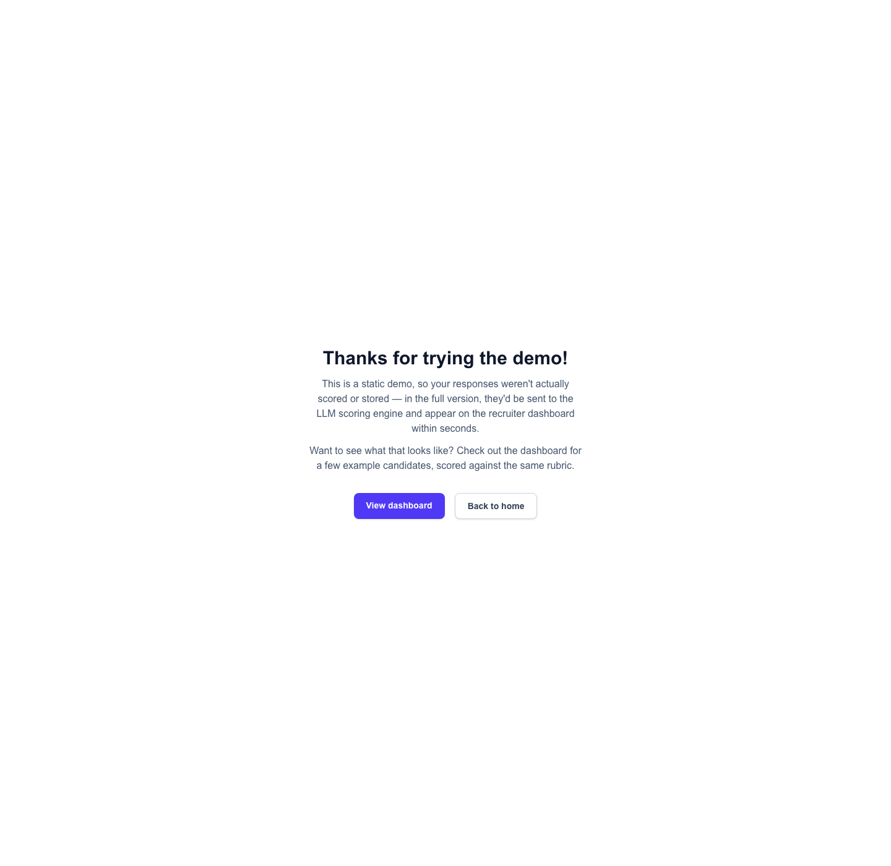

# AI Safety Hiring — Prototype Walkthrough

A proof-of-concept hiring tool for AI safety orgs: candidates answer open-ended
questions (text, voice, or video), an LLM scores each answer against a written
rubric, and recruiters get a dashboard of scores, evidence, and flags.

Built for the Research Program Manager role at SaferAI as a worked example —
the same approach generalises to other roles.

---

## 1. Home

The landing page sets out what the tool does and why, before sending visitors
to either the candidate form or the recruiter dashboard.

**Why it matters:** Hiring tools are often a black box to candidates and a
wall of numbers to recruiters. Spelling out the approach up front — open-ended
answers scored against a rubric, with role-fit and judgment reported
separately — sets expectations for both audiences before they dive in.

---

## 2. Apply — job description & questionnaire

The full job description (responsibilities, "about you") sits at the top of
the form, followed by role-specific and cultural-fit questions. Each question
can be answered by typing, dictating via microphone, or recording a short
video.

**Why it matters:**
- **Open-ended questions over self-rating scales** — asking "tell me about a
  time you..." produces concrete, checkable evidence. Self-rated sliders
  ("rate your communication skills 1–5") are easy to inflate and hard to
  verify.
- **Multiple answer formats** — not everyone communicates best in writing
  under time pressure. Offering mic and video options removes a format
  barrier that has nothing to do with whether someone can do the job.
- **JD on the same page** — candidates can see exactly what they're being
  assessed against, rather than guessing what a vague question is really
  probing for.

---

## 3. Apply — confirmation

After submitting, candidates land on a confirmation page that explains what
would happen next in the full version (LLM scoring, appearing on the
recruiter dashboard) and links through to see example results.

**Why it matters:** Even in a demo, candidates shouldn't be left wondering
whether anything happened. Being explicit that this is a demo — and showing
what "real" output looks like — keeps the walkthrough honest while still
demonstrating the end-to-end flow.

---

## 4. Recruiter dashboard

A sortable list of candidates, each showing a **Readiness %** (role-specific
skills and experience) and a **Cultural Fit %** (judgment traits like
epistemic rigour and strategic foresight), plus colour-coded tags per
category — green for strengths, red for flagged gaps.

**Why it matters:**
- **Two scores, not one** — role readiness is the *floor* (can they do the
  job?) and cultural fit is the *ceiling* (how do they think under pressure
  or ambiguity?). Blending these into a single number hides exactly the
  trade-off a hiring panel needs to see: a technically strong candidate with
  poor judgment, or vice versa.
- **At-a-glance triage** — recruiters reviewing many applications need to
  spot strong and borderline candidates quickly without reading every answer
  first.

---

## 5. Candidate report

The full breakdown for one candidate: a TL;DR with a recommendation
(advance / probe / hold / pass), highlights and concerns, then every
rubric criterion with its score, rationale, and a quoted piece of evidence
from the candidate's actual answer.

**Why it matters:**
- **TL;DR with a recommendation** — busy hiring panels need a quick read on
  "should this person move forward?" before they dig into the detail. The
  recommendation is a simple rule applied to the readiness/cultural-fit
  numbers, not a separate AI judgement — it's a starting point, not a
  verdict.
- **Evidence, not just a score** — every score is backed by a quote from the
  candidate's own answer. This makes the scoring auditable: a recruiter can
  check whether the rationale actually holds up, and a candidate could in
  principle see why they were scored the way they were.
- **Flags for what to probe** — red flags (score ≤2) and green flags (score
  ≥4) point reviewers straight at what's worth following up on in an
  interview, rather than re-deriving it from nine separate criterion scores.
