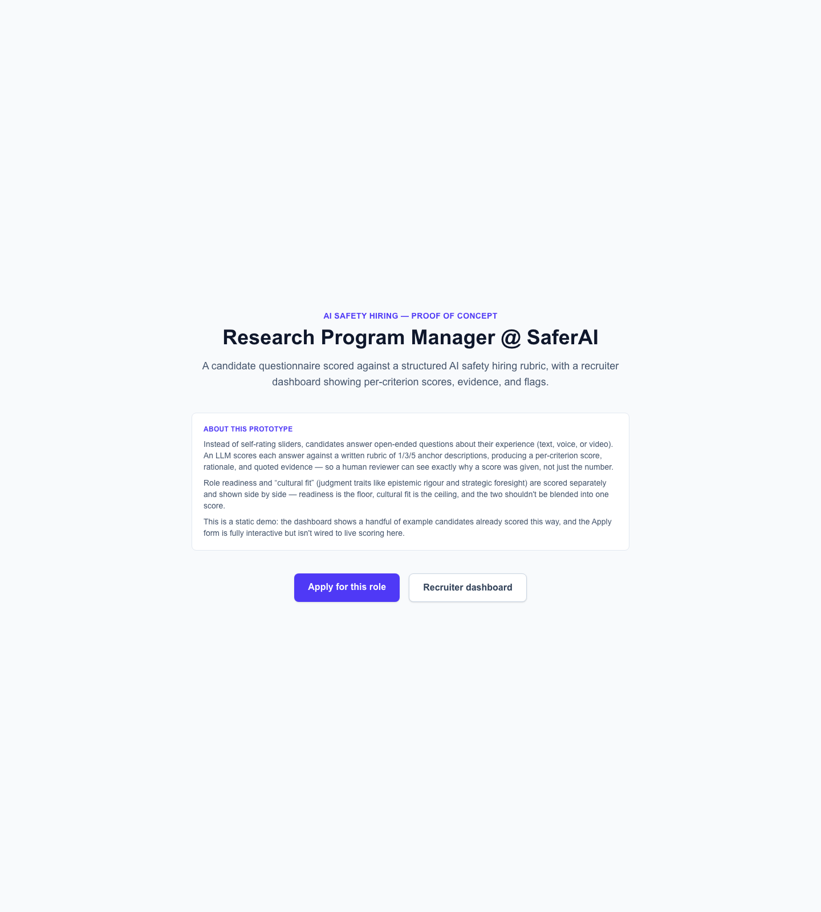
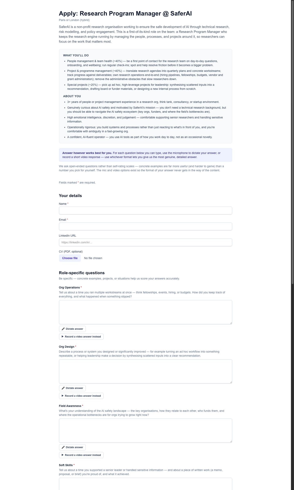
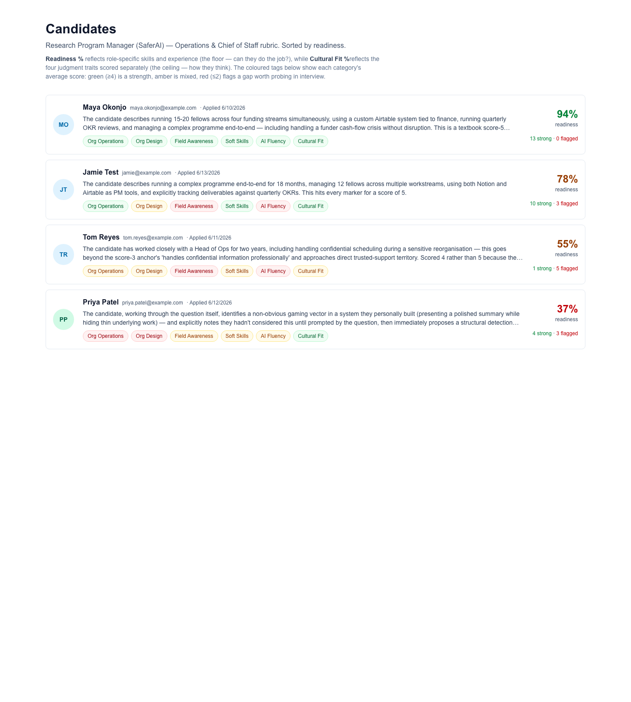
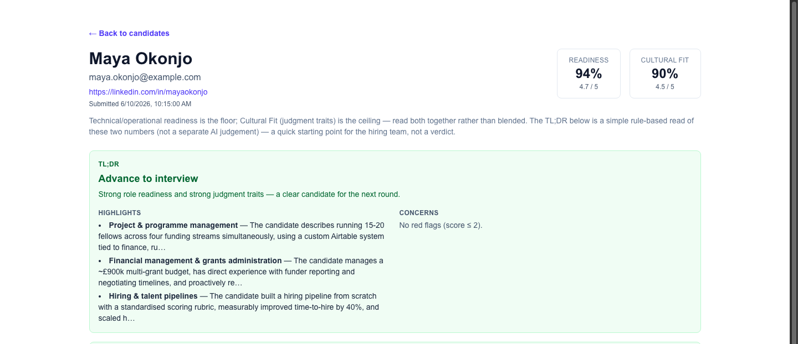

# AI Safety Hiring — Prototype

A hiring assessment tool for AI safety roles. Candidates answer open-ended questions — by
text, voice, or video — and an LLM scores each response against a written rubric, giving
recruiters a dashboard of per-criterion scores, quoted evidence, and flags.

## Contents

- [Overview](#overview)
- [Problem](#problem)
- [Solution](#solution)
- [Walkthrough](#walkthrough)
- [Rubric](#rubric)
- [Validation](#validation)
- [Limitations and what's next](#limitations-and-whats-next)
- [Built with](#built-with)

## Overview

Built by Georgia Hirth with [Emilio Noriega Farres](https://www.linkedin.com/in/emilio-noriega-farres/)
and [Marta Albertini Rios](https://www.linkedin.com/in/marta-albertini-rios/) in a single day at
the **Breaking Barriers to AI Safety Hackathon**, run by the London Initiative for Safe AI (LISA)
and BlueDot Impact — placed 3rd. Built as a worked example for the Research Program Manager role
at SaferAI; the same approach generalises to other roles.

## Problem

AI safety orgs are growing fast and need to hire for roles (especially operations and generalist
roles) where traditional hiring signals — credentials, polished interview performance — don't
reliably predict the judgment traits that actually matter for safety work. The hackathon's focus
is lowering barriers to entry into AI safety, particularly for generalists and non-technical
people who feel the field moves too fast to break into, or that "everyone is already ahead of
them." This prototype is an attempt at a hiring process that's more transparent for candidates
and more consistent for recruiters.

## Solution

Instead of self-rating sliders or CV keyword-matching, candidates answer open-ended questions —
by text, voice, or video — and an LLM scores each response against a written rubric. Two scores
are reported separately rather than blended into one: **Readiness** (role-specific hard skills
and experience) and **Cultural Fit** (four "unteachable" judgment traits — security mindset,
epistemic rigour, strategic foresight, conceptual engineering).

## Walkthrough

### Flow 1 — Candidate applies

The landing page sets out what the tool does and why — open-ended answers scored against a
rubric, with role-fit and judgment reported separately — before sending visitors to either the
candidate form or the recruiter dashboard.

The full job description sits at the top of the form, followed by role-specific and
cultural-fit questions, each answerable by typing, dictating via microphone, or recording a
short video.

- **Open-ended questions over self-rating scales** — "tell me about a time you..." produces
  concrete, checkable evidence. Self-rated sliders are easy to inflate and hard to verify.
- **Multiple answer formats** — not everyone communicates best in writing under time pressure;
  mic and video options remove a format barrier that has nothing to do with whether someone can
  do the job.
- **JD on the same page** — candidates see exactly what they're being assessed against, rather
  than guessing what a vague question is really probing for.

After submitting, candidates land on a confirmation page explaining what would happen next in
the full version (LLM scoring, appearing on the recruiter dashboard) — this is a static demo, so
nothing is actually scored here.

### Flow 2 — Recruiter reviews

A sortable list of candidates, each showing a **Readiness %** and a **Cultural Fit %**, plus
colour-coded tags per category — green for strengths, red for flagged gaps.

- **Two scores, not one** — role readiness is the floor (can they do the job?) and cultural fit
  is the ceiling (how do they think under pressure or ambiguity?). Blending these into one
  number hides exactly the trade-off a hiring panel needs to see.
- **At-a-glance triage** — recruiters reviewing many applications need to spot strong and
  borderline candidates quickly without reading every answer first.

Drilling into one candidate: a TL;DR with a recommendation (advance / probe / hold / pass),
highlights, and concerns. Below the fold (not pictured here), every rubric criterion is broken
down individually with its score, rationale, and a quoted piece of evidence from the candidate's
actual answer.

- **TL;DR with a recommendation** — a simple rule applied to the readiness/cultural-fit numbers,
  not a separate AI judgement — a starting point, not a verdict.
- **Evidence, not just a score** — every score is backed by a quote from the candidate's own
  answer, so a recruiter can check whether the rationale actually holds up.

## Rubric

Candidate answers are scored against a written rubric of 1/3/5 anchor descriptions per
criterion — see [Rubric.md](Rubric.md) for the full set of criteria, weights, and anchors used
for both role-specific scoring and the four cultural-fit judgment traits.

## Validation

**Built-in**: the dashboard's four synthetic test candidates span a 37%–94% readiness spread
with quoted, evidence-backed rationale per criterion — the rubric discriminates meaningfully
rather than clustering everyone at the same score.

**External**: the same judgment-trait framing was also tested outside this prototype, against a
real candidate pool. Using Jack and Jill (`app.jackandjill.ai`), a third-party AI recruiting
tool, a role was set up with equivalent criteria (Systems Building, Ops Breadth, Clarity &
Judgment) and run against roughly 6,000 real candidate profiles:

*(Candidate photos redacted — this shows the labelling methodology, not identifiable
individuals.)*

It labelled 20 candidates against the trait criteria in about 10 seconds, surfacing several
90-plus scoring matches — evidence the trait-based framing works on a real, much larger
candidate pool, not just on hackathon-day synthetic data.

## Limitations and what's next

These are static, open-ended questions rather than a live conversation — the natural next step
is something more adaptive, adjusting its follow-up questions to how a candidate actually
responds. That's a problem space the hackathon day didn't leave time to explore; this prototype
is a first-level MVP.

## Built with

Next.js (App Router), React, TypeScript, and Tailwind CSS, with the Anthropic API for
rubric-based LLM scoring.
