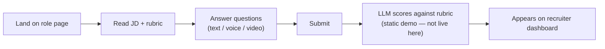
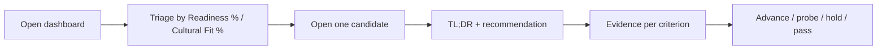
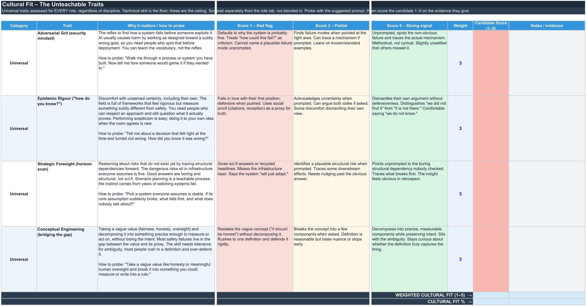
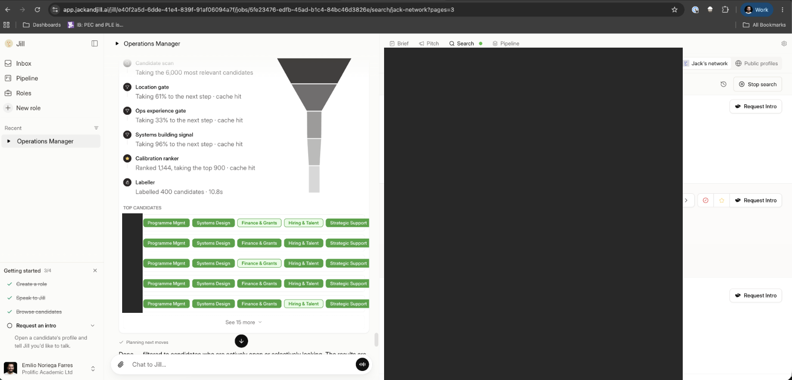

# AI Safety Hiring — Prototype

A hiring assessment tool for AI safety roles. Candidates answer open-ended questions — by
text, voice, or video — and an LLM scores each response against a written rubric, giving
recruiters a dashboard of per-criterion scores, quoted evidence, and flags.

## Contents

- [Overview](#overview)
- [Problem](#problem)
- [Solution](#solution)
- [User Journeys](#user-journeys)
- [Rubric](#rubric)
- [Validation](#validation)
- [Limitations and what's next](#limitations-and-whats-next)
- [Related](#related)
- [Built with](#built-with)

## Overview

Built by Georgia Hirth with [Emilio Noriega Farres](https://www.linkedin.com/in/emilio-noriega-farres/)
and [Marta Albertini Rios](https://www.linkedin.com/in/marta-albertini-rios/) in a single day at
the **Breaking Barriers to AI Safety Hackathon**, run by the London Initiative for Safe AI (LISA)
and BlueDot Impact — placed 3rd. Built as a worked example for the Research Program Manager role
at SaferAI; the same approach generalises to other roles.

## Problem

The AI safety hiring market is broken on both sides:

- **No transparency, for candidates** — candidates apply into a void: no feedback, no signal, no
  idea where they fell short. The silence is demoralising and uninformative.
- **Capacity constraint, for hiring managers** — small orgs have no time to review applicants
  carefully. When bandwidth is scarce, shortcuts win, and shortcuts favour the familiar.
- **The keyword-trait trap, for both** — hiring filters on credentials and keywords, the easy
  things to scan, and systematically misses the judgment that actually predicts impact.

## Solution

Two layers, one score. Every candidate is scored on what you can teach and what you can't:

- **Hard skills** — role-specific competencies drawn directly from real AI safety job postings,
  not assumption.
- **Four unteachable traits**, each with structured 1/3/5 behavioural anchors so two reviewers
  score the same evidence the same way:
  - **Adversarial Grit (security mindset)** — holds up under pressure and pushback.
  - **Epistemic Rigour** — updates on evidence, not ego.
  - **Strategic Foresight** — thinks in second-order consequences.
  - **Conceptual Engineering** — builds and refines the right mental models.

Who it's for:

- **Hiring managers** — assess judgment fast and consistently across every applicant; the rubric
  does the heavy lifting so small teams can review at scale.
- **People trying to break in** — from any background, finally see what's actually being
  assessed and where the gaps are; the tool that judges you also coaches you.

## User Journeys

**Candidate flow:**

**Hiring-manager flow:**

See [WALKTHROUGH.md](WALKTHROUGH.md) for the full screenshot-by-screenshot version of both flows.

## Rubric

Candidate answers are scored on two axes — role readiness and cultural fit — using 1/3/5
behavioural anchors per criterion, so two reviewers scoring the same answer land on the same
score. The full rubric isn't published here, to keep the assessment meaningful rather than
something to write answers to — but here's a glimpse of the scoring structure it's built from:

## Validation

The four traits are a reasoned hypothesis, not a validated model — this is directional discovery
work, not a validation study, and we say so. Three things grounded it before a single question
was written:

- **A real job seeker's experience** — we spoke to someone applying into AI safety about where
  the process breaks down: no feedback, no signal, no idea where they fell short. That pain
  shaped the design from the start.
- **Job board analysis** — the hard-skills layer is built from analysing every AI safety role on
  the 80,000 Hours job board, not assumption.
- **Platform testing against a real candidate pool** — we tested the same trait-based criteria on
  Jack and Jill, a third-party AI recruiting tool, sourcing for a generalist operations role:

*(Names, photos, and identifying details redacted — this shows the funnel and methodology, not
identifiable individuals.)*

From a pool of roughly 6,000 candidates, sequential gates — location (61% passed), ops
experience (33% passed), a systems-building signal (96% passed) — narrowed the field; a
calibration ranker then ranked the top 900, and a labelling pass scored 400 candidates against
the trait criteria in under 11 seconds. Sourcing on judgment traits rather than standard keyword
search surfaced a wider and more diverse candidate pool than the usual search would have.

## Limitations and what's next

Following directly from the hedge above, the honest next steps are:

- **Calibration mode** — two reviewers score one candidate independently and compare where they
  diverge.
- **Validation against real hires** — checking the scores against how people actually performed
  once hired.
- **A candidate-facing release** — today this is recruiter-facing tooling; candidates seeing their
  own results is a deliberate next step, not an afterthought.

## Related

**[adaptive-interview-concept](https://github.com/HoopieUX/adaptive-interview-concept)** — a
standalone, early-stage proof of concept exploring a more conversational, adaptive version of the
candidate interview. A separate project, not part of this prototype.

## Built with

Next.js (App Router), React, TypeScript, and Tailwind CSS, with the Anthropic API for
rubric-based LLM scoring.
